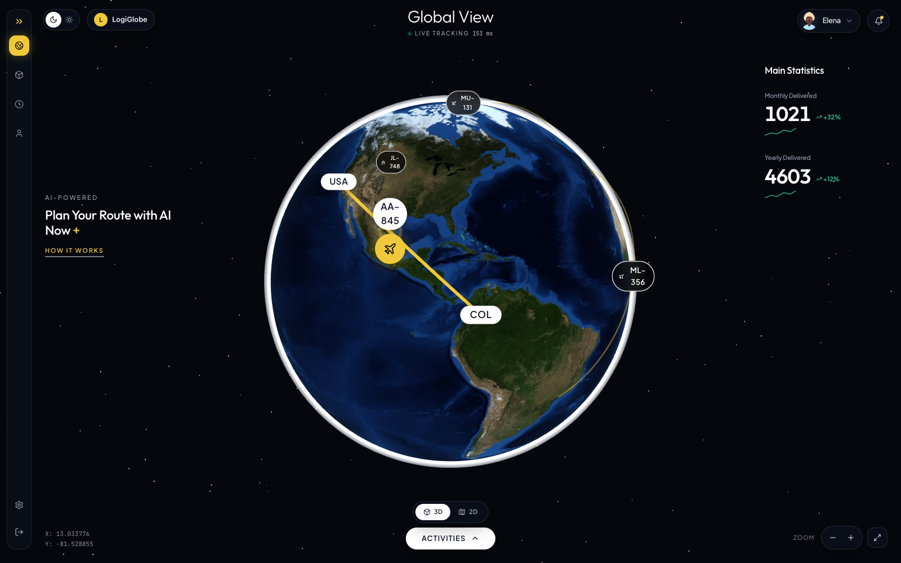
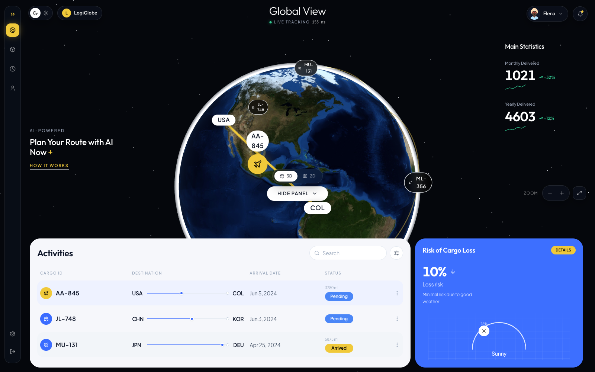
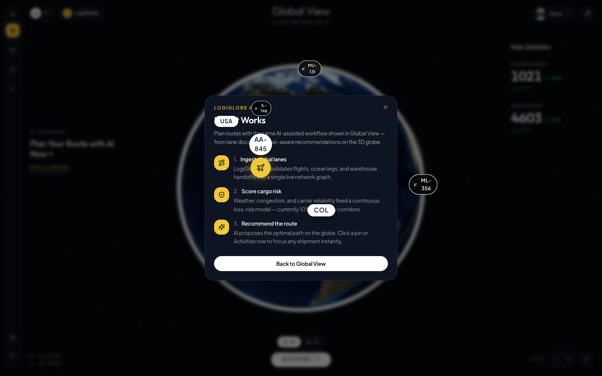

# LogiGlobe

<p align="center">
  
</p>

<p align="center">
  <strong>Premium 3D Global View</strong> logistics dashboard<br/>
  Interactive Earth · live routes · glass UI · AI route planning
</p>

<p align="center">
  <a href="#quick-start"></a>
  
  
</p>

---

## Preview

| Global View | Activities | How it Works |
|:---:|:---:|:---:|
|  |  |  |

---

## Features

- **Interactive 3D globe** — day-side Earth with soft cyan atmosphere, OrbitControls (drag / zoom / pan)
- **Yellow flight corridors** — hardcoded lanes including **AA-845 USA → COL**, JL-748, MU-131, ML-356
- **Clickable markers** — select a flight to highlight its arc and table row
- **Activities panel** — search + status filter, destination progress, Pending / Arrived badges
- **Risk of Cargo Loss** — 10% risk card with weather gauge
- **3D / 2D toggle** — flat equirectangular map fallback
- **Live coordinates** — X / Y update as you explore
- **How it Works** — modal explaining AI-assisted route planning

---

## Tech stack

| Layer | Choice |
| --- | --- |
| App | Vite · React 18 · TypeScript |
| UI | Tailwind CSS · lucide-react |
| 3D | three · @react-three/fiber · @react-three/drei |

---

## Quick start

```bash
npm install
npm run dev
```

Open **http://localhost:5173**

| Script | Description |
| --- | --- |
| `npm run dev` | Local development server |
| `npm run build` | Production build to `dist/` |
| `npm run preview` | Preview the production build |

---

## Project structure

```text
src/
  components/
    globe/       # Earth, atmosphere, routes, markers, 2D map
    layout/      # Top bar, sidebars, controls, coords
    panels/      # Activities, risk, How it Works
    ui/          # Badges, pills, progress
  data/          # Hardcoded flights + stats
  hooks/         # Dashboard state
  lib/           # Geo helpers (lat/lon ↔ 3D)
```

All shipment and statistics data is **hardcoded** for demo purposes — no backend or API keys required.

---

## Keyboard shortcuts

| Key | Action |
| --- | --- |
| `A` | Toggle Activities panel |
| `Esc` | Close panels / modal |

---

## Notes

- Earth imagery is loaded from a public Blue Marble CDN at runtime (network required on first load).
- No `.env` secrets are used in this project.

---

## License

MIT
